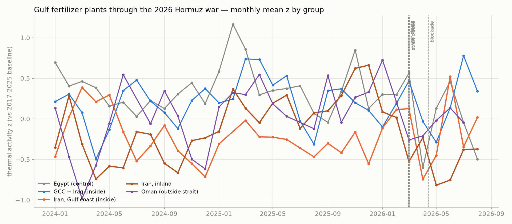
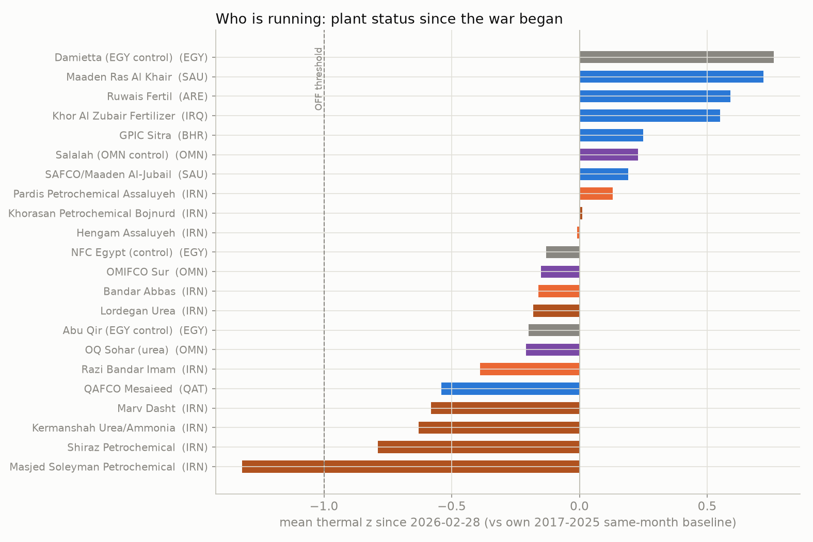
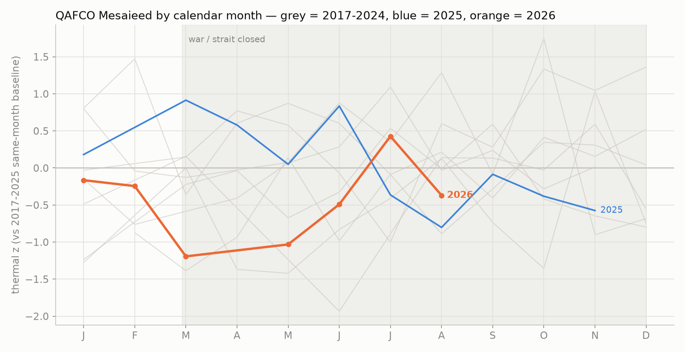

# Hormuz 2026: Gulf fertilizer plant status

- War 2026-02-28; strait closed 03-02; blockade 04-13. Baseline: fixed (site, month) 2017-2025.
- Sites scored: 22; scenes since war: 520

## QAFCO Mesaieed seasonal view

2026 breaks to z = -1.2 in March, the month the strait closed, and stays ~-1.0
through May before a partial recovery from June (July +0.43). Single-site months
are noisy (grey spread), but three consecutive low months aligned with the war
onset is what the -0.54 since-war mean is made of.

## Status table (sorted by z since war)
| name                           | country   | position   |   z_since_war |   n_scenes |   z_2025_ref | last_obs   | status   |
|:-------------------------------|:----------|:-----------|--------------:|-----------:|-------------:|:-----------|:---------|
| Masjed Soleyman Petrochemical  | IRN       | inland     |         -1.32 |         17 |         0.48 | 2026-08-18 | OFF      |
| Shiraz Petrochemical           | IRN       | inland     |         -0.79 |         38 |        -0.27 | 2026-08-21 | REDUCED  |
| Kermanshah Urea/Ammonia        | IRN       | inland     |         -0.63 |         30 |         0.19 | 2026-08-25 | REDUCED  |
| Marv Dasht                     | IRN       | inland     |         -0.58 |         36 |        -0.07 | 2026-08-21 | REDUCED  |
| QAFCO Mesaieed                 | QAT       | inside     |         -0.54 |         29 |         0.18 | 2026-08-21 | REDUCED  |
| Razi Bandar Imam               | IRN       | inside     |         -0.39 |         16 |         0.05 | 2026-08-18 | ON       |
| OQ Sohar (urea)                | OMN       | outside    |         -0.21 |         19 |         0.3  | 2026-08-24 | ON       |
| Abu Qir (EGY control)          | EGY       | control    |         -0.2  |         20 |        -0.17 | 2026-08-22 | ON       |
| Lordegan Urea                  | IRN       | inland     |         -0.18 |         56 |         0.51 | 2026-08-27 | ON       |
| Bandar Abbas                   | IRN       | inside     |         -0.16 |         17 |        -0.27 | 2026-08-07 | ON       |
| OMIFCO Sur                     | OMN       | outside    |         -0.15 |         20 |         0.18 | 2026-08-26 | ON       |
| NFC Egypt (control)            | EGY       | control    |         -0.13 |         37 |         0.58 | 2026-08-16 | ON       |
| Hengam Assaluyeh               | IRN       | inside     |         -0.01 |         18 |        -0.61 | 2026-08-13 | ON       |
| Khorasan Petrochemical Bojnurd | IRN       | inland     |          0.01 |         17 |        -0.74 | 2026-08-22 | ON       |
| Pardis Petrochemical Assaluyeh | IRN       | inside     |          0.13 |         20 |        -0.26 | 2026-08-29 | ON       |
| SAFCO/Maaden Al-Jubail         | SAU       | inside     |          0.19 |         18 |         0.22 | 2026-08-27 | ON       |
| Salalah (OMN control)          | OMN       | outside    |          0.23 |         14 |         0.17 | 2026-06-20 | ON       |
| GPIC Sitra                     | BHR       | inside     |          0.25 |         18 |         0.24 | 2026-08-20 | ON       |
| Khor Al Zubair Fertilizer      | IRQ       | inside     |          0.55 |         18 |         0.56 | 2026-08-25 | ON       |
| Ruwais Fertil                  | ARE       | inside     |          0.59 |         33 |         0.22 | 2026-08-22 | ON       |
| Maaden Ras Al Khair            | SAU       | inside     |          0.72 |         17 |         0.73 | 2026-08-27 | ON       |
| Damietta (EGY control)         | EGY       | control    |          0.76 |         12 |         0.68 | 2026-08-15 | ON       |

## Group means since war
| site_id       |   mean |   count |
|:--------------|-------:|--------:|
| egypt_control |   0    |      69 |
| gcc_inside    |   0.25 |     133 |
| iran_coastal  |  -0.09 |      71 |
| iran_inland   |  -0.53 |     194 |
| oman_outside  |  -0.07 |      53 |

## Placebo check: Mar-Aug group mean z by year

| group | 2017 | 2018 | 2019 | 2020 | 2021 | 2022 | 2023 | 2024 | 2025 | **2026** |
|---|---|---|---|---|---|---|---|---|---|---|
| iran_inland | -0.23 | 0.06 | -0.35 | -0.59 | 0.17 | 0.68 | 0.24 | -0.40 | 0.10 | **-0.53** |
| iran_coastal | -0.10 | 0.19 | 0.64 | 0.22 | 0.38 | -0.21 | -0.15 | -0.03 | -0.26 | **-0.09** |
| gcc_inside | -0.50 | -0.19 | -0.34 | -0.20 | -0.06 | 0.16 | 0.07 | 0.16 | 0.33 | **0.25** |

## Conclusions

1. **No Gulf-wide fertilizer shutdown.** GCC + Iraq plants inside the strait ran at or
   above baseline through the closure and blockade (group +0.25; Ras Al Khair +0.72,
   Ruwais +0.59, Khor Al Zubair +0.55) - production continued even with exports bottled up.
   The one GCC exception is QAFCO Qatar at -0.54 (was +0.18 same months 2025): a real
   reduction, plausibly gas reallocation with LNG shipping halted.
2. **Iran's coastal export complexes kept running.** Pardis (+0.13) and Hengam (-0.01)
   at Assaluyeh, Bandar Abbas (-0.16), Razi (-0.39): thermally indistinguishable from
   normal despite blocked exports. Thermal cannot size the load (W8) - this reads as
   "hot and operating", possibly into storage.
3. **Iran inland is the war casualty.** Group -0.53 since the war vs +0.10 in the same
   months of 2025 - the 2nd-lowest Mar-Aug in ten years (only COVID 2020 lower). Masjed
   Soleyman reads fully OFF (-1.32, first time; +0.48 last year); Shiraz, Kermanshah and
   Marv Dasht REDUCED. Pattern fits domestic gas triage / war disruption inland rather
   than the strait itself.
4. **Coverage survived the war**: 520 scenes since Feb 28 across 22 sites, latest
   observations Aug 27-29, 2026 - the monitor runs regardless of the blockade.
5. Caveats: per-site z from ~17-56 scenes; partial-load blindness (W8); Masjed Soleyman,
   Ras Al Khair and Sohar coordinates carry needs_verification=1 (their pre-war baselines
   behave normally, which is reassuring).
